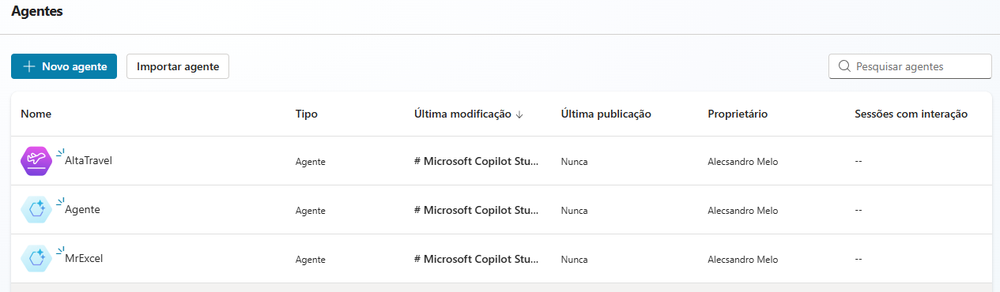

# Ensaio Copilot Studio
### Estudo sobre criação de Agentes no Copilot Studio

No Copilot Studio, a criação de agentes personalizados permite desenvolver soluções específicas para diferentes necessidades. Para testar essa funcionalidade, criei três agentes distintos, cada um com um propósito único.

O primeiro agente, chamado AltaTravel, foi baseado no modelo "Viagens Seguras". Seu objetivo principal é oferecer informações e recomendações para viajantes, garantindo segurança e praticidade durante deslocamentos. Utilizando um modelo predefinido, foi possível configurar respostas eficientes e adaptáveis às necessidades do usuário.

O segundo agente, batizado de MrExcel, foi construído a partir de um modelo descritivo de IA, tornando-se um especialista em Excel. A ideia foi criar um assistente capaz de fornecer dicas, resolver problemas de fórmulas e ajudar na automação de tarefas dentro das planilhas. Com sua configuração específica, MrExcel se tornou uma ferramenta poderosa para usuários que desejam maximizar a produtividade no Excel.

Por fim, o terceiro agente, denominado Agente, foi criado como um ambiente de teste sem configuração inicial. Esse agente serviu como um espaço para experimentar diferentes recursos e ajustes dentro do Copilot Studio, permitindo explorar funcionalidades e testar personalizações antes de implementá-las em agentes mais complexos.

Esses três agentes demonstram a flexibilidade do Copilot Studio, permitindo a criação de assistentes inteligentes adaptados a diferentes cenários e necessidades. 

_____

## ⚙️Tela do gerenciador de Agentes do Copilot Studio

